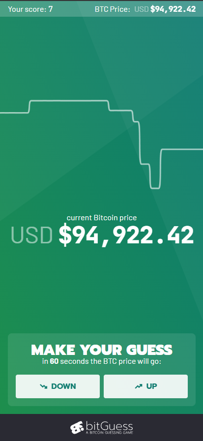
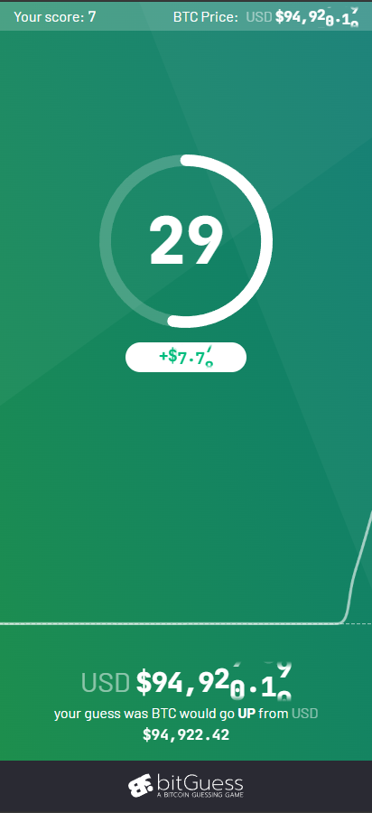
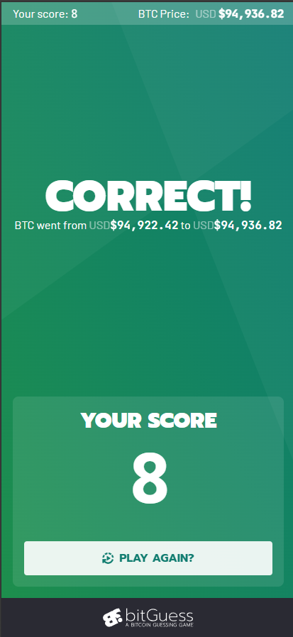

# BitGuess - Demo Project

  
  
  

> ### **Live Demo:** [https://d11smuquft4ec1.cloudfront.net](https://d11smuquft4ec1.cloudfront.net)

## What is this?

BitGuess is an implementation of the following brief:

### Task:

Build a web app that allows users to make guesses on whether the market price of Bitcoin (BTC/USD) will be higher or lower after one minute.

### Rules:

- The player can at all times see their current score and the latest available BTC price in USD
- The player can choose to enter a guess of either “up” or “down“
- After a guess is entered, the player cannot make new guesses until the existing guess is resolved
- The guess is resolved when the price changes and at least 60 seconds have passed since the guess was made
- If the guess is correct (up = price went higher, down = price went lower), the user gets 1 point added to their score. If the guess is incorrect, the user loses 1 point
- Players should be able to close their browser and return back to see their score and continue to make more guesses
- Players can only make one guess at a time
- New players start with a score of 0

### Solution requirements:

- The guesses should be resolved fairly using BTC price data from any available 3rd party API
- The score of each player should be persisted in a backend data store (AWS services preferred)

## Assumptions

There are a few ambiguities in the brief, I have outlined my approach/assumptions made:

1. The player can at all times see their current score and the latest available BTC price in USD
   - Given that BTC prices update continuously, I am just showing the latest price sent from the Binance websocket which is roughly a 1 second tick rate.

2. “The guess is resolved when the price changes and at least 60 seconds have passed since the guess was made”
   - Since the rule specifies “at least 60 seconds,” a guess is resolved using the first available price data point returned by the API after the 60-second threshold, rather than attempting to target the exact 60-second mark.

3. Scoring edge case
   - In the event that the resolution price is exactly equal to the entry price, the guess will be treated as a “no change” outcome, resulting in 0 points awarded or lost.

4. Error handling (not explicitly defined)
   - For the MVP, if an internal or external error occurs during resolution (e.g. the price API is temporarily unavailable), for fairness, the guess will be marked as VOID and treated as a “no change” outcome (0 points), allowing the player to try again.

## Approach

API first approach using OpenAPI. The source of truth for the frontend and backend are both the OpenAPI spec. The spec can be found at `/api/openapi.yaml`. Types are generated using the monorepo root npm command `npm run api:generate` or within the `/packages/api-types` directory running `npm run generate`.

The backend implements the package `openapi-backend` and hands requests to it for handling request routing and validation. See: `/backend/src/lambdas/http-api.ts`

The frontend implements the package `openapi-fetch` to make requests to the api also handling validation. See: `/frontend/src/services/useBitGuessApiService.ts`

## Brief Requirement Mapping

How I've addressed each specific point of the brief:

1. **"The player can at all times see their current score and the latest available BTC price"**
   - **Score**: Persistently displayed in the top-left header. It is fetched on initialization and updated optimally after every guess resolution.
   - **Price**: Streaming in real-time via a Binance WebSocket connection. It is visible in the header at all times and featured prominently during the guessing phase.

2. **"The player can choose to enter a guess of either 'up' or 'down'"**
   - **Controls**: Large, distinct buttons for "Up" and "Down" serve as the primary game controls.

3. **"After a guess is entered, the player cannot make new guesses until the existing guess is resolved"**
   - **State Machine**: The game strictly transitions through `PENDING` -> `RUNNING` -> `RESOLVING`. The UI removes controls during active rounds.
   - **Backend Validation**: The API enforces this constraint by rejecting any new guess requests (409 Conflict) if a player already has an unresolved guess.

4. **"The guess is resolved when the price changes and at least 60 seconds have passed"**
   - **Backend Job**: Submitting a guess triggers an SQS message with a 60-second delivery delay. This message invokes a Lambda function to resolve the round.
   - **Timing**: Resolution occurs slightly after the 60-second mark due to SQS delivery and execution time (`>= 60s`), fulfilling the "at least" requirement without requiring continuous polling.
   - **Fairness**: The start price is locked server-side upon request receipt, preventing client-side latency exploitation.

5. **"Correct checks (+1 / -1 point)"**
   - **Logic**: Scoring is handled atomically by the backend resolution service.
   - **Edge Case**: If the resolution price equals the start price, the result is "Void" (no points change).
   - **Integrity**: Score updates use DynamoDB conditional writes to ensure data consistency between the Player and Guess records (optimistic locking).

6. **"Players should be able to close their browser and return back"**
   - **Identity Model**: The application uses an anonymous authentication strategy. A random UUID `playerId` is generated on the first visit and stored in the browser's `localStorage` as a persistent token.
   - **Persistence**: This ID acts as a key to the server-side DynamoDB record containing the player's score and history.
   - **Session Restoration**: On return visits, the app reads this ID to rehydrate the user's score and check for any active/unresolved guesses, instantly effectively restoring the exact game state across reloads or browser restarts.
   - **Limitations**: Since there is no login system, manually clearing browser storage or switching devices will result in a new anonymous identity (score reset).

7. **"Score persisted in a backend data store (AWS services preferred)"**
   - **Database**: Amazon DynamoDB is utilized for its low-latency performance and scalability, storing both `Player` profiles and `Guess` history.

## Tech Stack

- Monorepo - NPM Workspaces
- Vitest
- NPM
- OpenAPI

### Frontend

- SvelteKit (Typescript, Svelte 5 Runes)
- Playwright (E2E Testing)

### Backend

- NodeJS (Typescript)
- Docker (For local dev only - localstack for SQS & dynamodb)
- AWS Sam Local (For local dev - API Gateway)

### Deployment

- AWS SAM

## Project Structure

- **api** ~ OpenAPI specifications
- **backend** ~ Serverless Node.js application
  - **lambdas** ~ AWS Lambda function entrypoints
  - **routes** ~ Business logic handlers for API routes
  - **services** ~ Shared domain logic and external integrations
  - **utils** ~ Portable backend utility functions
- **docs** ~ Project documentation and assets
- **frontend** ~ SvelteKit web application
  - **src** ~ Frontend source code
    - **lib** ~ Shared library code
      - **components** ~ Svelte UI components
      - **services** ~ Frontend API clients and state logic
      - **utils** ~ Portable frontend utility functions
    - **routes** ~ SvelteKit pages and layouts
- **packages** ~ Shared monorepo packages
  - **api-types** ~ Generated TypeScript types from OpenAPI
  - **config** ~ Shared configuration constants

## Infrastructure (AWS)

Below is a diagram outlining the AWS infrastructure used for deployment

## Game Flow

Below is a diagram showing the general high level flow of the game

## Local Development

### Requirements (installed locally):

1. Docker & Docker Compose
2. AWS CLI and AWS SAM
3. Git
4. Node & NPM

### Installation

1. Clone monorepo `git clone git@github.com:brenthoneybone/bitguess.git`
2. From in the monorepo root
3. Install project deps `npm i`
4. Start docker backend services `npm run backend:docker:up`
5. Bootstrap local AWS resources: `bash backend/scripts/bootstrap-local.sh`
6. Generate shared API types: `npm run api:gen`

### Run the stack

_Note: The following commands should be run in separate terminals_

1. Start backend dev server `npm run backend:dev`
2. Start SQS worker service `npm run backend:worker`
3. Start frontend dev server `npm run frontend:dev`
4. Have fun

## Testing

Run unit and integration tests across the monorepo:

- Fullstack: `npm test`
- Frontend (Unit + E2E): `npm frontend:test`
- Backend (Unit): `npm backend:test`

Or with coverage:

- Fullstack: `npm test:coverage`
- Frontend (Unit + E2E): `npm frontend:test:coverage`
- Backend (Unit): `npm backend:test:coverage`

## Deployment

Follow steps under local development to set up the project

_Note: Infrastructure will automatically be deployed along with code if any changes are made_

From the monorepo root you can deploy the:

- Fullstack: `npm run deploy`
- Backend only: `npm run backend:deploy`
- Frontend only: `npm run frontend:deploy`

## Known issues

1. **Lambda Cold Starts**: Because the backend runs on serverless AWS Lambda functions, the first request after a period of inactivity may experience higher latency (2-5 seconds). This affects the initial fetching of player data and may cause the first guess resolution to take slightly longer than 60 seconds.
   - **Proposed Solution**: Enable Provisioned Concurrency for critical functions to keep execution environments initialized, or implement a "keep-warm" EventBridge schedule that pings the lambdas every 5 minutes.

2. **Anonymous Session Loss**: Player identity is currently stored solely in the browser's `localStorage`.
   - **Impact**: Clearing browser data, using "Incognito" mode, or switching devices will result in the loss of player score and history.
   - **Proposed Solution**: Implement a proper authentication system (e.g., Auth0 or AWS Cognito) to link player IDs to persistent user accounts.

3. **Public API Rate Limits**: The application relies on the public Binance API for price data without an API key.
   - **Impact**: In a high-traffic scenario or if AWS IPs are flagged, the external price fetch might fail due to rate limiting (HTTP 429), causing guess resolutions to error out or delay.
   - **Proposed Solution**: Register for a Binance API key or implement a round-robin strategy with multiple price providers (CoinGecko, Coinbase, Kraken) to ensure redundancy.

## Further Improvements & Features

### Architecture & Backend

1. **Server Sent Events (SSE)**: Implement SSE/WebSockets for real-time guess resolution pushes, eliminating frontend polling.
2. **Dead Letter Queues (DLQ)**: Add DLQs to SQS to capture failed guess resolutions for inspection and replay.
3. **Data Lifecycle**: Implement EventBridge schedules to partition/archive old guess data and cleanup stale anonymous users.
4. **Provider Abstraction**: Create service adapters to decouple core logic from specific providers (Binance/AWS).
5. **Provider Redundancy**: Implement failover strategies with multiple price providers (CoinGecko, Coinbase, Kraken) to mitigate rate limits and downtime.
6. **Cache BTCPrice**: Once the game scaled, keep a cache of the BTC price so not all resolver invocations make a BTC Price external call.

### Security & Reliability

1. **Authentication**: Replace local storage ID with robust Auth (Cognito/OAuth) for cross-device persistence and account recovery.
2. **WAF & Rate Limiting**: Protect the public API Gateway with Web Application Firewall and usage plans.
3. **Observability**: Add structured JSON logging, X-Ray tracing, and CloudWatch Dashboards for system health monitoring. Particularly around guess resolution.

### UX & Frontend

1. **Visual Polish**: Add celebratory animations for wins and clearer transitions (View Transitions API).
2. **Guess History**: Show a list of past guesses and their outcomes.
3. **Accessibility**: Conduct an a11y audit to ensure keyboard navigation and screen reader support.
4. **PWA**: Make the application installable on mobile devices.
5. **Onboarding**: Add a "How to Play" tutorial overlay for new users.
6. **Chart Animations** Add animations to chart to prevent snapping when data changes.

### DevOps & DX

1. **Improve Builds/Monorepo**: Implement Turborepo for better task orchestration and build caching.
2. **CI/CD**: specific pipelines for linting, testing, and deployment (GitHub Actions).
3. **Full Dockerization**: Containerize the dev environment completely (DevContainers) to remove local host dependencies (AWS CLI, SAM, Node).
4. **Contract Testing**: Implement contract tests to strictly enforce OpenAPI spec compliance between frontend and backend.
5. **Shared Configuration**: Move shared constants and logic to a dedicated core package in the monorepo.
6. **Performance Optimization**: Enable Provisioned Concurrency for critical Lambdas to eliminate cold starts and ensure consistent <1s response times.

### Product Analytics

1. **User Tracking**: Implement telemetry to understand player retention, session length, and feature usage to prioritize the roadmap.

### User Engagement Features

_Note: The current MVP focuses on core mechanics. Adding variability and progression systems would significantly improve long-term retention._

1. **Leaderboards**: Global high/low score tables (Daily/Weekly/All-time). Potentially win % based and filtered by minimum guess count.
2. **Game Variations**: Allow user to change between different countdown times (10s, 30s, 60s, 10m etc).
3. **Statistics**: Detailed user & global stats - Total guesses, % correct, longest streak, etc.
4. **Game Modes**: Add extra game modes - E.g. "Price is Right" mode: guess the price of common items (e.g., car, fridge) in Bitcoin.
5. **Multiplayer**: Modes allowing users to challenge friends or strangers in real-time.
